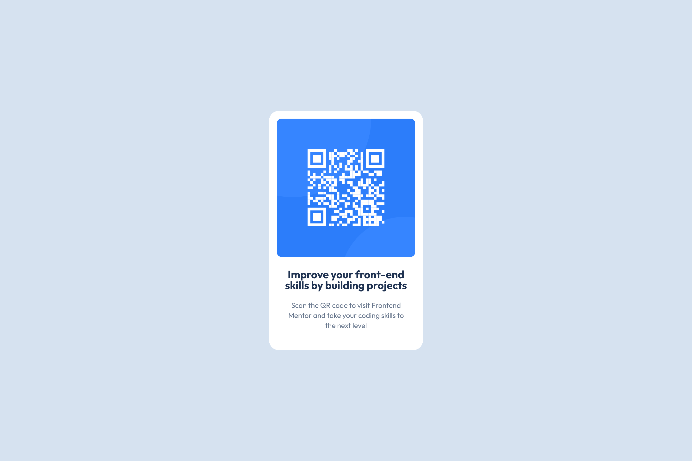

# QR component

This is a solution to the [QR code component challenge on Frontend Mentor](https://www.frontendmentor.io/challenges/qr-code-component-iux_sIO_H).

## Overview

### Screenshots

| _Mobile Screenshot (375x812)_             | _Desktop Screenshot (1440x960)_             |
| ----------------------------------------- | ------------------------------------------- |
|  |  |

### Live demo

- Live Site URL: [here](https://michele-cini.github.io/qr-code-component/)

## My process

### Tech used

- HTML5
- CSS3
- Git
- GitHub
